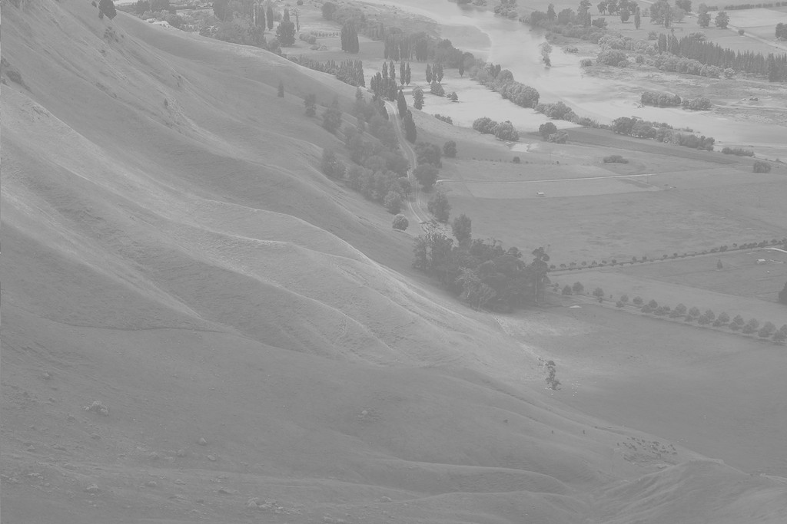
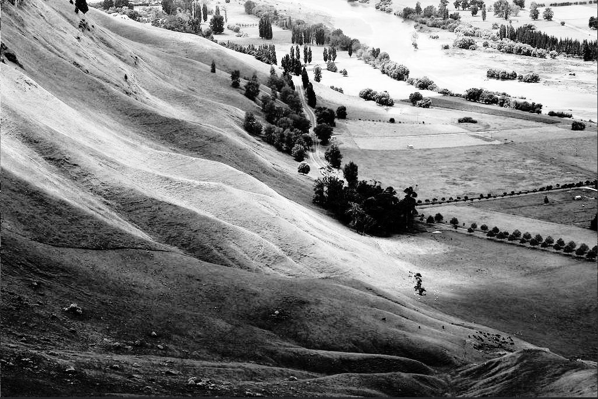

# Image Equalisation Program

Both local and global parallel implementations of equalisation algorithms to correct image contrast, using the OpenCL framework. Supports variable bin size and number.
The algorithm works by sorting each colour that appears in the image into a bin, then once each colour total has been found this data set is normalised and the image reconstructed. Both colour and greyscale images can be operated on (*.ppm* and *.pgm* files respectively).

## Demo

Before                     |  After
:-------------------------:|:-------------------------:
 |  
In colour           |  
 |  
With a reduced bin number (i.e. fewer colours in the output)  |
 |  
